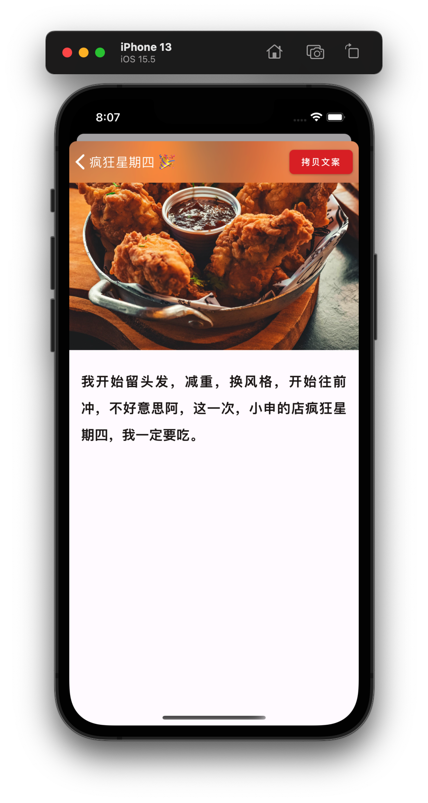

<div align="center" >
  <h1>
    
    <p>疯狂星期四 🎉</p>
  </h1>
</div>

[](./LICENSE)
[](./package.json)
[](./package.json)
[](https://github.com/shensven/Crazy-Thursday/actions/workflows/test.yml)
[](https://github.com/shensven/Crazy-Thursday/actions/workflows/publish.yml)
[](https://www.codacy.com/gh/shensven/Crazy-Thursday/dashboard?utm_source=github.com&utm_medium=referral&utm_content=shensven/Crazy-Thursday&utm_campaign=Badge_Grade)

发给你的好友，让 TA 请你吃炸鸡！

|                       iOS Home                       |                    iOS Detail                    |
| :--------------------------------------------------: | :----------------------------------------------------: |
|  |  |

## 📦 安装方式

### 前往 App Store 下载 iOS 版本

iOS 正式版尚未发布，不过你可以[申请](https://forms.gle/yUHmX9MVkbEDssPM7)加入我们的 TestFlight 进行先行体验

### 前往 Play Store 下载 Android 版本

Android 正式版尚未发布，不过你可以在 Github [Release](https://github.com/shensven/Crazy-Thursday/releases) 页面下载预览版 apk 安装包进行先行体验

### 前往 GitHub Release 下载 Android apk

[Release](https://github.com/shensven/Crazy-Thursday/releases)

## 🔨 编译

### 简介

- 使用 [React Native](https://reactnative.dev) 编写
- 使用 [WhiteSource Renovate](https://www.whitesourcesoftware.com/free-developer-tools/renovate) 保持依赖在同一个大版本下始终最新
- 使用 [Github Workflow](https://github.com/shensven/Readhub-RN/actions) 进行测试、持续集成和持续交付
- 项目启用了 [Hermes](https://hermesengine.dev)，因此推荐使用 [Flipper](https://fbflipper.com) 进行调试

### 先决条件

- [Node 14](https://nodejs.org) 或更高版本
- [yarn](https://yarnpkg.com/getting-started/install) 包管理器
- [Watchman](https://formulae.brew.sh/formula/watchman)
- [Xcode 10](https://developer.apple.com/xcode/resources)或更高版本
- [CocoaPods](https://guides.cocoapods.org/using/getting-started.html)
- [JDK 11](https://formulae.brew.sh/formula/openjdk@11) 或更高版本
- Android SDK
  - Build-Tools `31.0.0`
  - NDK `21.4.7075529`

### 起步

```sh
yarn install
cd ios && pod install
```

### 模拟器调试

```sh
yarn ios
```

```sh
yarn android
```

### 真机调试

```sh
npm install -g ios-deploy
```

```sh
yarn ios --device
```

```sh
yarn android
```

### 测试

```sh
yarn test
```

```sh
cd android && chmod +x gradlew && ./gradlew test
```

### iOS 真机部署

```sh
yarn ios --configuration Release --device
```

### 打包 Android apk

```sh
cd android && ./gradlew assembleRelease
```

### 生成开屏图

```sh
yarn react-native generate-bootsplash src/assets/splash/bootsplash.png \
  --background-color=EDE0DE \
  --logo-width=192 \
  --flavor=main
```
