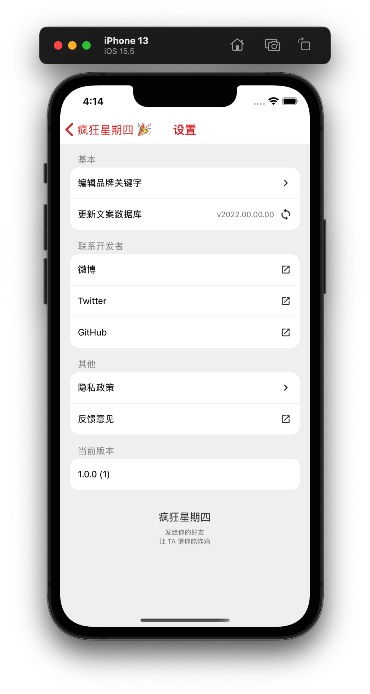
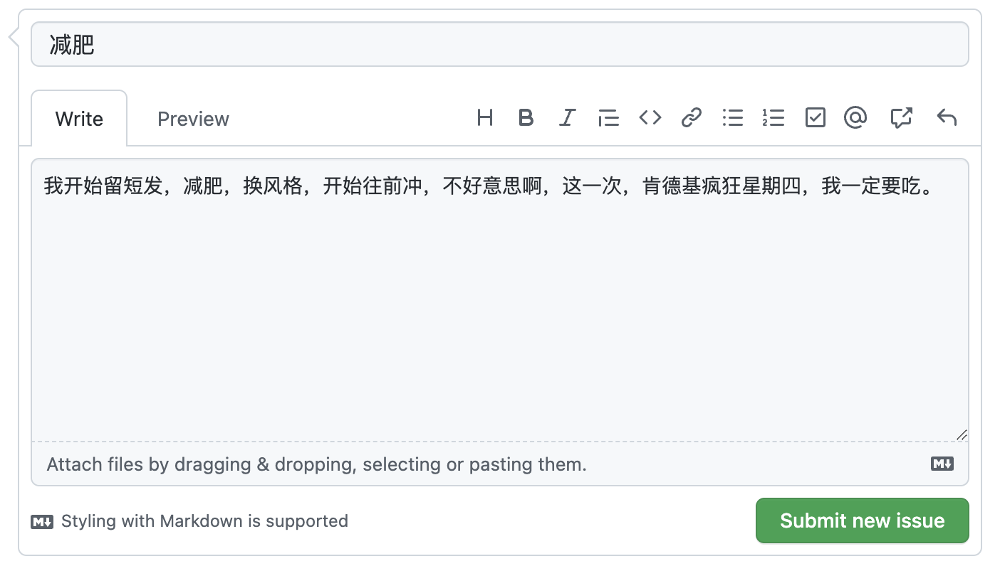

<div align="center" >
  <h1>
    
    <p>疯狂星期四 🎉</p>
  </h1>
</div>

[](./LICENSE)
[](./package.json)
[](./package.json)
[](https://github.com/shensven/Crazy-Thursday/actions/workflows/test.yml)
[](https://github.com/shensven/Crazy-Thursday/actions/workflows/publish.yml)
[](https://www.codacy.com/gh/shensven/Crazy-Thursday/dashboard?utm_source=github.com&utm_medium=referral&utm_content=shensven/Crazy-Thursday&utm_campaign=Badge_Grade)


发给你的好友，让 TA 请你吃炸鸡！

|                         首页                         |                          详情                          |                        设置                         |
| :--------------------------------------------------: | :----------------------------------------------------: | :-------------------------------------------------: |
|  |  |  |

## 📦 分发方式

### iOS 版本

- <a href="https://apps.apple.com/cn/app/%E7%96%AF%E7%8B%82%E6%98%9F%E6%9C%9F%E5%9B%9B/id1636127634"></a>

### Android 版本

- <a href="https://play.google.com/store/apps/details?id=com.shensven.crazythursday"></a>
- 前往 [GitHub Releases](https://github.com/shensven/Crazy-Thursday/releases) 页面下载 apk 安装包

## 🔨 编译

### 简介

- 使用 [React Native](https://reactnative.dev) 编写
- 使用 [Dependabot](https://github.com/features/security/software-supply-chain) 保持依赖在同一个大版本下始终最新
- 使用 [Github Actions](https://github.com/shensven/Readhub-RN/actions) 进行测试、持续集成和持续交付
- 项目启用了 [Hermes](https://hermesengine.dev)，因此推荐使用 [Flipper](https://fbflipper.com) 进行调试

### 先决条件

- [Node 14](https://nodejs.org) 或更高版本
- [yarn](https://yarnpkg.com/getting-started/install) 包管理器
- [Watchman](https://formulae.brew.sh/formula/watchman)
- [Xcode 10](https://developer.apple.com/xcode/resources)或更高版本
- [CocoaPods](https://guides.cocoapods.org/using/getting-started.html)
- [JDK 11](https://formulae.brew.sh/formula/openjdk@11) 或更高版本
- Android SDK
  - Build-Tools `31.0.0`
  - NDK `21.4.7075529`

### 起步

```sh
yarn install
cd ios && pod install
```

### 模拟器调试

```sh
yarn ios
```

```sh
yarn android
```

### 真机调试

```sh
npm install -g ios-deploy
```

```sh
yarn ios --device
```

```sh
yarn android
```

### 测试

```sh
yarn test
```

```sh
cd android
chmod +x gradlew
./gradlew test
```

### iOS 真机部署

```sh
yarn ios --configuration Release --device
```

### 打包 Android apk

```sh
cd android
./gradlew assembleRelease
```

### 生成开屏图

```sh
yarn react-native generate-bootsplash src/assets/splash/bootsplash.png \
  --background-color=ECE9E9 \
  --logo-width=192 \
  --flavor=main
```

## ✍️ 贡献文案

前往 [issues](https://github.com/shensven/Crazy-Thursday/issues/new) 页面发布你的贡献文案，【标题】和【正文】随意

示例如下



## 👍 致谢

- [Nthily/KFC-Crazy-Thursday](https://github.com/Nthily/KFC-Crazy-Thursday) - 主要文案来源

## 📜 许可证合规性

[](https://app.fossa.com/projects/git%2Bgithub.com%2Fshensven%2FCrazy-Thursday?ref=badge_large)
